# Pick-a-Book

## Overview

Pick-a-Book is an e-commerce application developed with ASP.NET Core, dedicated to the sale of books. It offers a comprehensive platform for users to purchase their favourite reads. The application includes features such as user authentication, a shopping cart system, order processing, and an intuitive user interface.

## Technologies Used

- ASP.NET Core MVC
- C#
- Visual Studio 2022
- Entity Framework Core
- MSSQL Server
- HTML/CSS
- jQuery
- JavaScript
- Bootstrap
- Font awesome
- Stripe
- Facebook login/register

## Features

Pick-a-Book comes packed with a wide variety of features to enhance your online book shopping experience.

- **User Authentication and Authorization**: The application has well-implemented user authentication and authorization feature, a variety of roles for access control and Facebook login/register.

- **Catalog**: On the home page, users can easily view and access detailed information about each book.

- **Shopping Cart**: Users can get full shopping experience with the convenient shopping cart functionality.

- **Stripe Payment Integration**: The app integrates the Stripe payment system, enhancing the security and efficiency of the purchase process.

## Screenshots

Here are some screenshots showcasing the key functionalities of the application:

**User Authentication and Authorization**:

#### Login Page

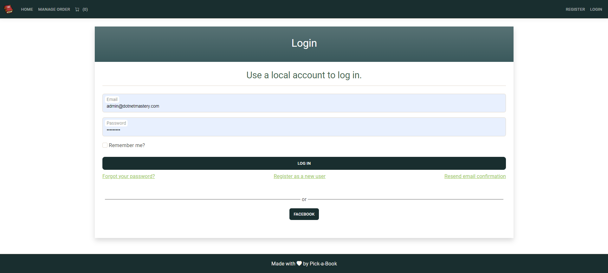

#### Register Page

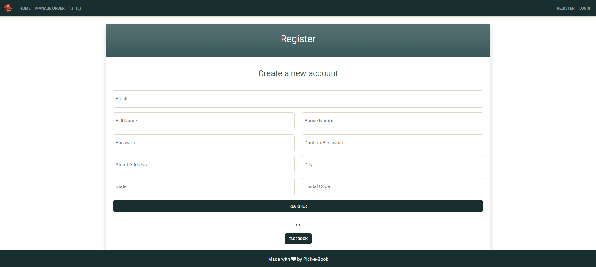

**Catalog**:

#### Home Page

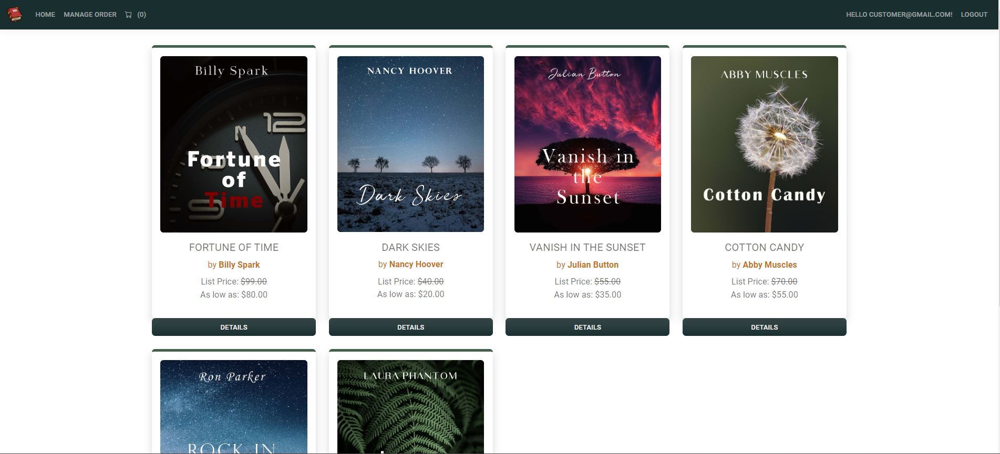

#### Book Details Page

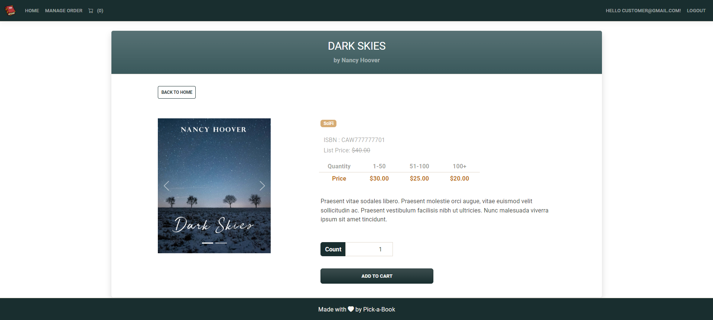

**Shopping Cart**:

#### Cart Overview

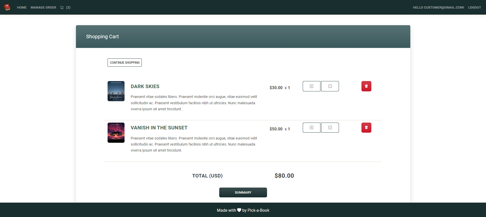

#### Cart Summary Page
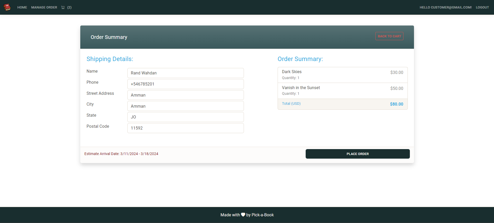

#### Stripe Checkout Page
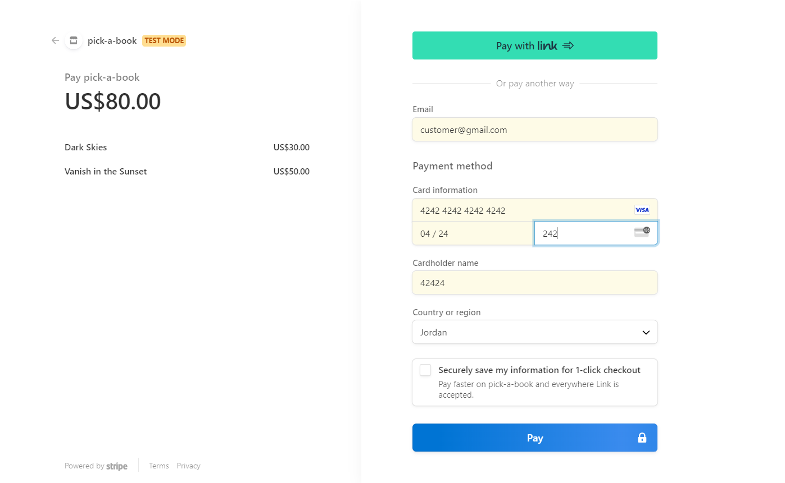

#### Order List
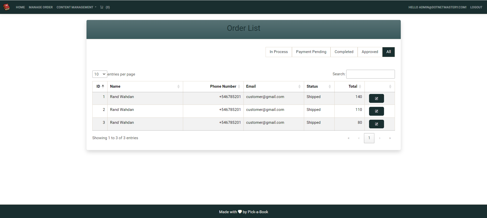

#### Order Confirmation Page
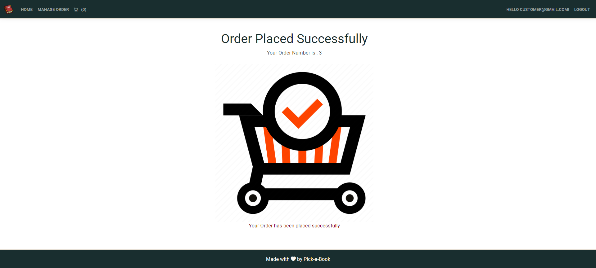

#### Admin Order Details Page
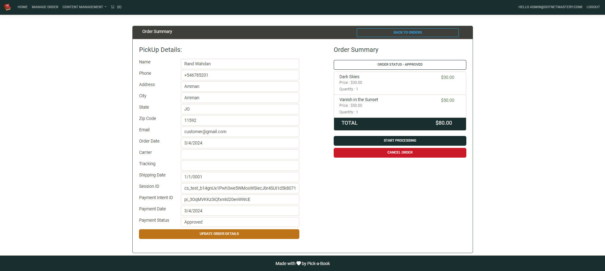
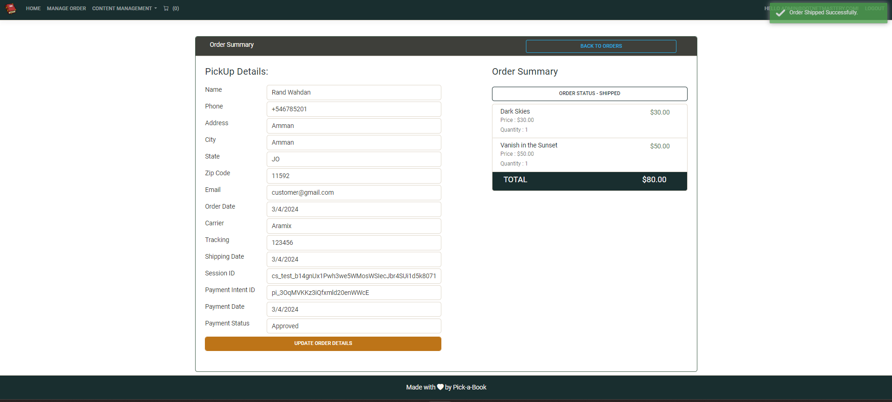

#### Users List to be managed by Admin
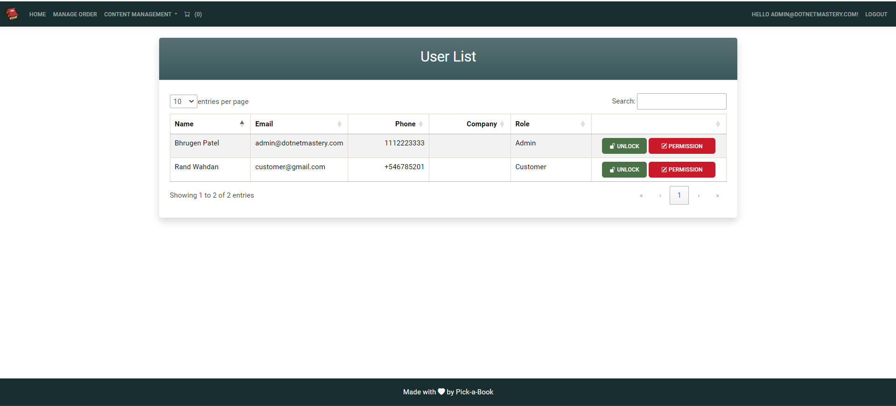

## Summary

The project is for educational purpose only and was part of my learning journey in ASP.NET Core. It was developed with guidance from this course https://www.udemy.com/course/complete-aspnet-core-21-course/. 

